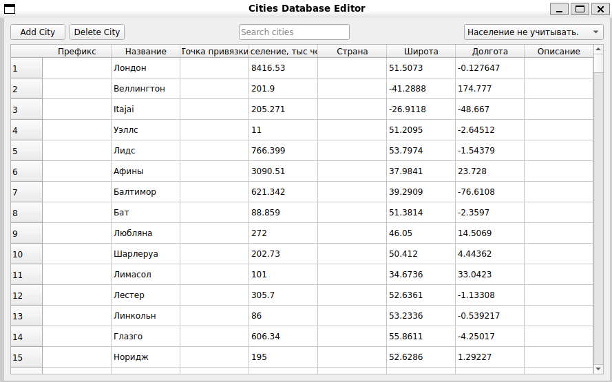
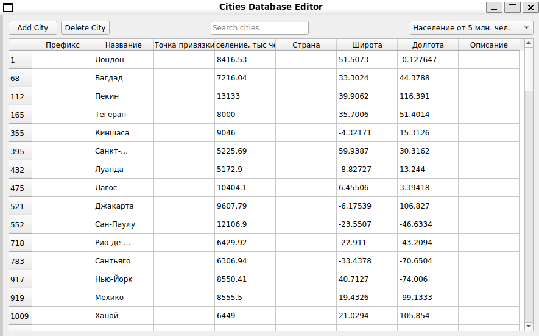
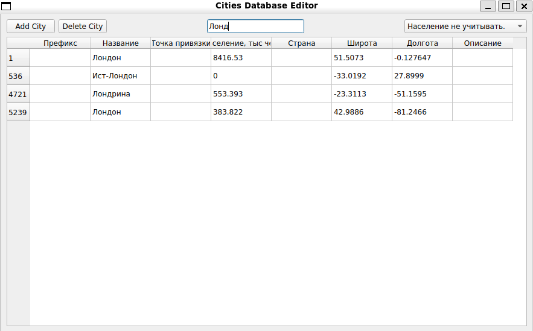
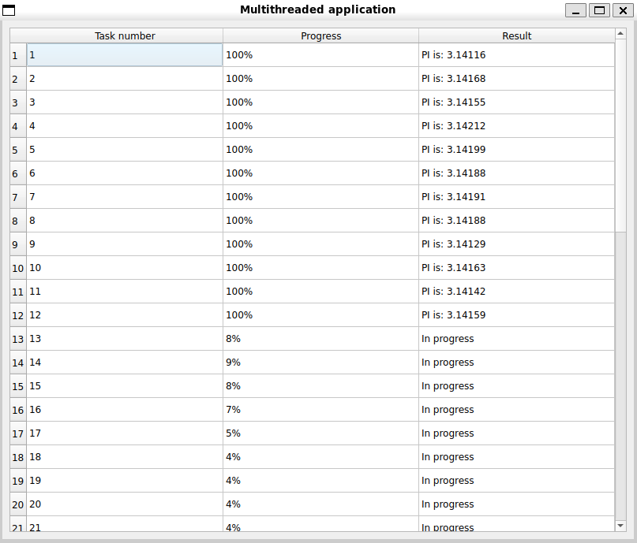
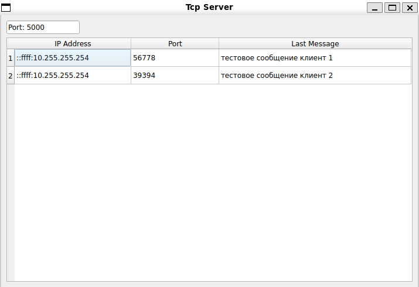

# Тестовое задание СТЦ
## Условия
- Язык реализации: `С++17`
- Библиотека: `Qt 5.15.13`
- ОС: `Ubuntu 24.04`
- Компилятор: `GCC 13`
- Система сборки: `CMake`
## Задание 1
### Редактор базы данных населенных пунктов
### Реализовано:
- CRUD операция для создания, удаления и редакторирования населенных пунктов
- Вывод таблицы населенных пунктов через `QTableView`
- Фильтрация для таблицы населенных пунктов через `QSortFilterProxyModel`
- - Выпадающий список с населением 
- - Текстовое поле по всем полям таблицы
- База данных SqlLite передается через аргументы командной строки через параметр `database`

### Скриншоты
#### Стандартный графический интерфейс таблицы

#### Графический интерфейс таблицы с фильтрацией по населению от 5 млн. чел.

#### Графический интерфейс таблицы с фильтрацией по текстовому полю

## Задание 2
### Многопоточное графическое приложение с отслеживанием прогресса выполнения задач
### Реализовано:
- Управление потока через `QThreadPool` и `QRunnable`
- Вычисление числа $\pi$ методом Монте-Карло в качестве ресурсоемкой задачи
- Обновление прогресса и результатов через сигналы и слоты

### Скриншоты
#### Графический интерфейс

## Задание 3
### Графическое приложение, работающее как TCP-сервер, отображающее информацию о всех подключениях
### Реализовано:
- Отображение номера порта, который слушает сервер
- Отображение информации о подключенных клиентах (IP адрес клиента, порт клиента, последнее переданное клиентом сообщение)
- Удаление из таблицы отключившихся клиентов
- Принудительный разрыв соединение с выбранным клиентом
- Порт передается через аргументы командной строки через параметр `port`
### Скриншоты
#### Графический интерфейс
